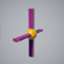

# Resources

### 1. GameJam Toy 검색 방법

1-1. 스튜디오의 오른쪽 하단에 위치한 툴박스를 찾아 검색필터 기능을 사용합니다.

1-2. 검색필터의 Tag 항목에서 Sci_Fi를 선택하고 APPLY 버튼을 누르면 GameJam Toy가 표시됩니다.

1-3. 툴박스에서 토이를 마우스로 클릭하면, 현재 보고있는 화면에 토이가 생성됩니다.

### 2. GameJam Toy 목록

| 번호 | 이름 | 이미지 | 설명 | 설정값 |
| :---: | :--- | :---: | :--- |:--- |
| 1 | RollingPart |  | 일정 패턴으로 반복해서 회전하는 Toy 입니다.    회전 방향과 속도를 설정할 수 있습니다. |  **Axis X / Y / Z**   - 회전할 방향 값   **Speed**   - 회전하는데 걸리는 Sec |                                                                           
| 2 | MovePart |  | 일정 패턴으로 반복해서 움직이는 Toy 입니다.   방향과 거리, 속도를 설정할 수 있습니다. |  **Distance X / Y / Z**   - 이동할 방향 값     **Speed**   - 이동하는데 걸리는 Sec    **WaitTime** - 이동 후 대기하는 Sec |                                                                           
| 3 | Crevase |  |  플레이어가 접촉하면 떨어져서 사라지는 Toy 입니다.    배치할 때 다른 객체와 너무 붙여놓으면 안떨어지는 경우도 있습니다.|    **PhysicsTime**    - 밟은 뒤 몇 초 후 떨어지나   **DeleteTime**   - 떨어진 뒤 삭제되는 시간 | 
| 4 | CheckPoint |  |  접촉하면 플레이어의 다음 시작 위치가 변경되는 Toy입니다.   필요한 만큼 복사해서 맵에 배치하면 됩니다. |  | 
| 5 | KillBox |  |  접촉하면 캐릭터가 사망하는 Toy입니다.   스크립트만 복사해 붙여넣으면 어떤 객체든 killBox로 만들 수 있습니다.|  | 
| 6 | TeleportPad |  |   플레이어가 TeleportInPad에 접촉하면 TeleportOutPad로 순간이동하는 Toy입니다.    2개가 한 세트입니다. 취급에 주의하세요. |  **TeleportTime**   - 텔레포트 하기까지의 대기시간 |  
| 7 | Fan |  | 일정 시간마다 Fan이 동작하면서 Floor에 접촉되어 있는 플레이어를 밀어내는 Toy입니다.   밀려나는 범위를 넓히고 싶다면 Floor 객체의 크기를 조정해보세요.  |  **Speed**    - 객체가 밀려나는 속도   **OnTime**   - 선풍기가 정지상태에서 가동까지 걸리는 시간   **OffTime**   - 선풍기 가동 후 정지하기 까지 걸리는 시간   **FanSpeed**   - 선풍기 돌아가는 속도 |                                                                                                                                                   
| 8 | Lift |  |  플레이어가 올라타면 내려가는 리프트 Toy 입니다. 협동 플레이에 적합합니다.   응용하면 점프 시 올라가는 엘리베이터 같은 걸로 개조할 수 있습니다.|  **LiftSpeed**  - Lift 움직이는 속도 (1인 기준) |                                                                                                                                                      
| 9 | Lift_Button |  | 버튼을 밟고 있는 동안  내려오는 리프트 Toy입니다. 협동 플레이에 적합합니다.   응용하면 자동 엘리베이터 같은 걸로 개조할 수 있습니다. |  **LiftSpeed**  - Lift 움직이는 속도 (1인 기준)|                                                                                                                                                      
| 10 | BuffSpawner |  |  일정 시간마다 Buff를 생성해주는 Toy입니다.   옵션으로 일정시간 능력을 변화시키는 4종의 Buff Item을 포함하고 있습니다.  |  ___Spawner Property___    **SpawnCount**   - 버프가 나올 최대 개수 (예 -> 10으로 하면 버프가 10번 생성되면서 더이상 생성 X) **SpawnTime**  - 버프가 스폰되는 시간      ___Item Property___    **Duration**  - 버프  지속 시간  **Heal**  - 힐 버프 획득 시 회복량  **SpeedPlus**  - 이속 버프 획득 시 증가량 **JumpPlus** - 점프 버프 획득 시 증가량 |                                                                                                                                                       
| 11 | StopWatch |  |  스타트 라인에 접촉하면 타이머가 실행되며, 엔드 라인에 접촉하면 타이머가 멈추는 Toy입니다. |   |       
| 12 | Turret_1 |  | 플레이어가 접근하면 추적해 공격하는 터렛 Toy입니다. 친숙한 기본 외형입니다.   총알에 다양한 효과를 넣어 보세요. |   **ScanTime**  - 스캔 대기시간 **FireTime** - 발사 대기시간 **FireDistance** - 포착 거리 **LightColorR** - LightColor 변경할 Color R 값 **LightColorG** - LightColor 변경할 Color G 값 **LightColorB** - LightColor 변경할 Color B 값 **BulletSpeed** - Bullet이 목적지까지의 도착시간 (초단위) **BulletDamage** - 캐릭터가 Bullet에 맞았을 때 줄 대미지   |      
| 13 | Turret_2 |  | 플레이어가 접근하면 추적해 공격하는 터렛 Toy입니다. 개선된 외형입니다.   총알에 다양한 효과를 넣어 보세요.|&nbsp;&nbsp;&nbsp;&nbsp;&nbsp;&nbsp;&nbsp;&nbsp;&nbsp;&nbsp;&nbsp;&nbsp;&nbsp;&nbsp;&nbsp;&nbsp;&nbsp;&nbsp;&nbsp;&nbsp;&nbsp;&nbsp;&nbsp;&nbsp;&nbsp;&nbsp;"|
| 14 | Turret_3 |  | 플레이어가 접근하면 추적해 공격하는 터렛 Toy입니다. 많이 개선된 외형입니다.   총알에 다양한 효과를 넣어 보세요.|&nbsp;&nbsp;&nbsp;&nbsp;&nbsp;&nbsp;&nbsp;&nbsp;&nbsp;&nbsp;&nbsp;&nbsp;&nbsp;&nbsp;&nbsp;&nbsp;&nbsp;&nbsp;&nbsp;&nbsp;&nbsp;&nbsp;&nbsp;&nbsp;&nbsp;&nbsp;"|
| 15 | Turret_4 |  | 플레이어가 접근하면 추적해 공격하는 터렛 Toy입니다. 너무 개선된 외형입니다.   총알에 다양한 효과를 넣어 보세요. |&nbsp;&nbsp;&nbsp;&nbsp;&nbsp;&nbsp;&nbsp;&nbsp;&nbsp;&nbsp;&nbsp;&nbsp;&nbsp;&nbsp;&nbsp;&nbsp;&nbsp;&nbsp;&nbsp;&nbsp;&nbsp;&nbsp;&nbsp;&nbsp;&nbsp;&nbsp;"|
| 16 | CrashBlock_HP |  | HP가 있는 벽 오브젝트 Toy입니다.  벽과 충돌하면 벽의 HP가 감소되며, 벽의 HP가 0이되면 파괴됩니다. |    **HP**   - 벽에 설정할 HP  **MaxHP**  - 벽의 최대 HP 설정  **IsDelete**  - 벽이 파괴 된 후 삭제할지 말지 여부 **DeleteTime**  - 벽이 파괴돈 후 삭제될때 까지의 시간 **ObjectDamage**  - 캐릭터가 아닌 오브젝트가 충돌 시 입을 대미지  | 
| 17 | JumpPad_Auto |  | 접촉한 플레이어를 높이 점프시켜주는 Toy입니다.  |     | 
| 18 | JumpPad_Auto_PowerUP |  |   접촉한 플레이어를 매우 높이 점프시켜주는 Toy입니다.  |   **JumpPower** - 패드를 밞았을 때 적용되는 점프력  | 
| 19 | ConveryorBelt |  | 플레이어가 벨트 위에 올라타면 벨트를 따라 천천히 이동되는 Toy입니다.    벨트를 잘 사용하면 미끄러지는 바닥 효과를 낼 수 있습니다.  |**BeltSpeed8**  - 벨트 위에 올라간 객체가 얻는 추가 속도입니다. | 
| 20 | WeaponBox |  | 접촉하면 지정된 아이템을 장착해주는 Toy입니다. 현재 Rifle로 지정되어 있습니다.| Rifle Toy와 함께 사용해야 합니다. Rifle을 Toybox 폴더에 넣어야 동작합니다.  |
| 21 | BulletSupplyBox |  |  접촉하면 Rifle 무기의 탄환이 충전됩니다.| Rifle Toy와 함께 사용해야 합니다. | 
| 22 | Rifle_FPS |  |  플레이어와 접촉하면 장착되고 마우스 클릭으로 공격할 수 있는 라이플 Toy입니다.  FPS (1인칭) 용으로 설정되어 있습니다. |  ___Rifle.Script Parameters___  **Normal_Damage** - 공격력 **MaxBullet**  - 보유 최대 탄환 **BulletDistance**  - 총알의 사거리  **BulletSpeed** - 총알의 속도 **ShakeTime** - 발사 시 흔들리는 시간**ShakeScale**  - 발사 시 흔들리는 범위**CurBullet** - 현재 탄창 내 총알량**ReloadBullet** - 재장전 시 탄창 총알량 **ReloadTime** - 재장전 시간 **IsReload** - 재장전 상태임을  체크 **WeaponName** - HUD에 표시될 총 이름 | 
| 23 | Rifle_TPS |  | 플레이어와 접촉하면 장착되고 마우스 클릭으로 공격할 수 있는 라이플 Toy입니다.    TPS (3인칭) 용으로 설정되어 있습니다. |&nbsp;&nbsp;&nbsp;&nbsp;&nbsp;&nbsp;&nbsp;&nbsp;&nbsp;&nbsp;&nbsp;&nbsp;&nbsp;&nbsp;&nbsp;&nbsp;&nbsp;&nbsp;&nbsp;&nbsp;&nbsp;&nbsp;&nbsp;&nbsp;&nbsp;&nbsp;"|
| 24 | SlidingDoor_Auto |  | 접근하면 자동으로 열리는 문 Toy입니다. |   **MoveTime** - 문 열린 뒤 닫히는 시간 **MoveSpeed** - 문이 움직이는 속도 |
| 25 | SlidingDoor_Button |  |   버튼을 밟으면 문이 열리는 도어 Toy입니다. |   **MoveTime** - 문 열린 뒤 닫히는 시간  **MoveSpeed** - 문이 움직이는 속도 |
| 26 | FanToy |  |  캐릭터를 밀어내는 선풍기 Toy입니다. |  **Speed** - 객체가 밀려나는 속도  **OnTime** - 선풍기가 정지상태에서 가동까지 걸리는 시간 **OffTime** - 선퐁기 가동후 정지하기 까지 걸리는 시간 **FanSpeed** - 선풍기 돌아가는 속도 |
| 27 | LadderToy |  | 구조물을 오를 수 있게 도와주는 사다리 Toy입니다. |  |   
| 28 | Pushable_Object |  | 벽에 몇초 이상 접근하면 미는 방향으로 움직이는 벽 Toy입니다. |  **CheckTime** - 캐릭터가 몇초이상 밀어야 움직일지 결정할 시간  **MoveSpeed** - 벽이 움직일 속도 **IsPush** - 벽을 밀 수 있는지 가능여부|
| 29 | SeatToy |  | 캐릭터가 앉을 수 있는 의자 Toy입니다. |  |
| 30 | SuperJump |  | Space키를 오래 누를수록 더 높게 점프할 수 있는 슈퍼 점프 모듈 Toy입니다.  배율값이 높을수록 점프 거리가 높아집니다. | **DefaultJump** - 기본 점프력  **JumpMultiple** -  입력 시간에 따른 점프 배율 값 |
| 31 | [Guys]  FallBlock |  | 밟으면 일정 시간 후 추락하는 Toy입니다. | **WavePower** - 흔들림 연출의 강도  **DeleteTime** -  발판을 밟고 삭제되기까지의 걸리는 시간 |
| 32 | [Guys]  SpeedBlock |  | 올라타면 진행 방향으로 자동 이동되는 가속 발판 Toy입니다.  이동속도가 높을 수록 가속도가 빨라집니다. | **MoveSpeed** - 캐릭터를 해당 방향으로 움직일 스피드 |
| 33 | [Guys]  RotBlock |  | 지정 방향으로 계속해서 회전하는 원판 Toy입니다. | **RotRandom** - 왼쪽, 오른쪽으로 회전하는 걸 랜덤으로 할건지에 대한 여부  **RotTime** - 총 회전하는데 걸리는 시간  **RotRight** - 시계 방향으로 돌건지 선택 (Random 선택하면 이건 적용 안됨) |
| 34 | [Guys]  AutoWallRightLeft |  | 캐릭터를 밀어내는 벽 Toy입니다. | **RightMoveTime** - 오른쪽으로 가기까지의 걸리는 시간 **RightWaitTime** - 오른쪽 도착 후에 대기  **LeftMoveTime** - 왼쪽으로 가기까지의 걸리는 시간  **LeftWaitTime** - 왼쪽 도착 후에 대기 시간  **MoveVector** - 위로 얼마나 올라갈지 결정 |
| 35 | [Guys]  AutoWallUpDown |  | 위아래로 이동하는 차단 벽 Toy입니다. | **UpMoveTime** - 위로 올라가기 까지 걸리는 시간 **UpWaitTime** - 위로 올라간 후에 대기 시간  **DownMoveTime** - 아래로 내려가기까지 걸리는 시간  **DownWaitTime** - 아래로 내려간 후에 대기 시간  **MoveVector** - 위로 얼마나 올라갈지 결정 |
| 36 | [Guys]  CrashDoorSet |  | 일정 시간 부딪히면 파괴되는 문 Toy 세트입니다.  | **CrashCount** - 몇번 부딪히면 파괴될지 횟수 **CollisionWait** - 충돌 후에 다음 충돌까지 걸리는 대기시간 **Force** - 파괴될 때 얼마만큼의 힘을 줄지 결정  **WavePower** - 흔들림 연출의 강도를 설정  **IsDelete** - 파괴된 후에 문을 제거할지 선택 **DeleteTime** - 문을 제거까지 걸리는 시간 **RandomSet** - 랜덤으로 몇개가 파괴가능하게 할 지 선택 |
| 37 | [Guys]  CrashDoor |  | 일정 시간 부딪히면 파괴되는 문 Toy입니다.  | **CrashCount** - 몇번 부딪히면 파괴될지 횟수 **CollisionWait** - 충돌 후에 다음 충돌까지 걸리는 대기시간 **Force** - 파괴될 때 얼마만큼의 힘을 줄지 결정  **WavePower** - 흔들림 연출의 강도를 설정  **IsDelete** - 파괴된 후에 문을 제거할지 선택 **DeleteTime** - 문을 제거까지 걸리는 시간 |
| 38 | [Guys]  LaunchBall |  | 일정 시간마다 구체를 발사하는 Toy입니다.  | **SpawnTime** - 공이 생성되기까지 걸리는 시간 **IsRandom** - 체크할 시 Base안에 있는 Ball중에 랜덤으로 생성 ( 체크풀 시 순차적으로 생성) **ForwardForce** - 공이 생설될 때 앞으로 치고나갈 힘  **MaxCount** - 총 생성될 개수 (설정한 값 이상은 더이상 생성안됨)  **BallKG** - 생성된 Ball의 무게를 설정 **DeleteTime** - 공이 생성 후 삭제까지의 시간 **Force** - 물체에 부딪힐 때 캐릭터가 날아가는 힘 |
| 39 | [Guys]  HitRoad |  | 좌우로 움직이며 진로를 방해하는 Toy입니다.  | **RotRandom** - 왼쪽, 오른쪽으로 회전하는 걸 랜덤으로 할건지에 대한 여부 **RotTime** - 총 회전하는데 걸리는 시간 **MoveTime** - 이동 하는데 까지 걸리는 시간  **Force** - 물체에 부딪힐 때 캐릭터가 날아가는 힘  **UpForce** -캐릭터가 떠오르는 힘 |
| 40 | [Guys]  RotWindmill |  | 지정 방향으로 계속해서 회전하며, 부딪히면 캐릭터를 반대로 밀어내는 Toy입니다.  | **RotRandom** - 왼쪽, 오른쪽으로 회전하는 걸 랜덤으로 할건지에 대한 여부 **RotTime** - 총 회전하는데 걸리는 시간 |
| 41 | [Guys]  RotHammer |  | 지정 방향으로 계속해서 회전하며, 부딪히면 캐릭터를 반대로 밀어내는 Toy입니다. | **RotRandom** - 왼쪽, 오른쪽으로 회전하는 걸 랜덤으로 할건지에 대한 여부 **RotTime** - 총 회전하는데 걸리는 시간  **Force** - 물체에 부딪힐 때 캐릭터가 날아가는 힘 **UpForce** - 캐릭터가 떠오르는 힘 |
| 42 | [Guys]  RotClock |  | 지정 방향으로 계속해서 회전하며, 부딪히면 캐릭터를 반대로 밀어내는 Toy입니다. | **RotRandom** - 왼쪽, 오른쪽으로 회전하는 걸 랜덤으로 할건지에 대한 여부 **RotTime** - 총 회전하는데 걸리는 시간  **Force** - 물체에 부딪힐 때 캐릭터가 날아가는 힘 **UpForce** - 캐릭터가 떠오르는 힘 |
| 43 | [Guys]  ClockWeight |  | 지정 방향으로 계속해서 회전하며, 부딪히면 캐릭터를 반대로 밀어내는 Toy입니다. | **Angle** - 추가 회전하는 각도 (해당 값만큼 왔다갔다함) **MoveTime** - 이동하는데 걸리는 시간  **Force** - 물체에 부딪힐 때 캐릭터가 날아가는 힘 **UpForce** - 캐릭터가 떠오르는 힘 |
 
  
    
  
  ###3. 맵별 추천 Toy검색 키워드
  
  Jump 1 - island , rock , tree , grass , flower , floating 
  Jump 2 - island , rock , tree , grass , flower , floating 
  Jump 3 - stone  
  Jump 4 - 어울리는 Toy가 없음. 기본제공 모델 사용  Neon Material 활용 
  Jump 5 - rock , junk , oasis 

 
