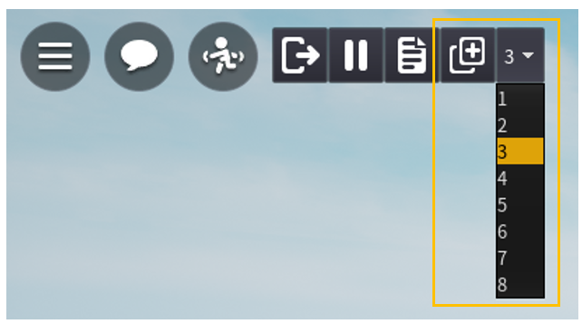

# Studio Manual

## 메뉴 바 - Menu Bar

기본적으로 스튜디오의 상단에 위치하고 있습니다. 원하는 위치에 이동시킬 수 있습니다.

편집된 스튜디오의 저장 및 불러오기등의 기능은 여기서 사용할 수 있습니다.

1. 파일 메뉴 \(FileMenu\)
2. 실행 취소 , 다시 실행 \(Undo , Redo\)
3. MultiTest 탭 메뉴
4. 빠른 실행 메뉴 (Quick Menu)

### 파일 메뉴 - File Menu

| Icon | Action | Key | Description |
| :--- | :--- | :---: | :--- |
|  | New | Ctrl+N | 템플릿 팝업을 열어 다른 템플릿 맵을 실행할 수 있습니다. |
|  | Open From File | Ctrl+O | 로컬 파일이 저장된 폴더를 엽니다. |
|  | Open From DITOLAND | Ctrl+Shift+O | 템플릿 팝업을 열어 DITOLAND 클라우드에 저장된 파일을 보여줍니다. |
|  | Save To File | Ctrl+S | 현재 편집중인 맵을 로컬 파일로 저장합니다. |
|  | Save To File As | Ctrl+Shift+S | 현재 편집중인 맵을 새 로컬 파일로 저장합니다. |
|  | Publish To DITOLAND | | 현재 편집중인 맵을 클라우드 저장소에 저장합니다. |
|  | Publish To DITOLAND As | | 현재 편집중인 맵을 클라우드 저장소의 새 슬롯에 저장합니다. |
|  | Reset | | WorldTree , Property , ToolBOX , Palette , Script Editor의 위치를 초기 위치로 되돌립니다. |
|  | Log Out | | 계정을 로그아웃하며 로그인 페이지로 이동합니다. |
|  | Exit | | 스튜디오를 종료합니다. |

### 빠른 실행 메뉴 - Quick Menu

| Icon | Action | Key | Description |
| :--- | :--- | :---: | :--- |
|  | Publish To DITOLAND |  | File Menu의 Publish To DITOLAND 기능과 동일합니다.  현재 편집중인 맵을 클라우드 저장소에 저장합니다. |
|  | Save To File | Ctrl+S | File Menu의 Save To File기능과 동일합니다.  현재 편집중인 맵을 로컬 파일로 저장합니다 |
|  | New | Ctrl+N | File Menu의 New 기능과 동일합니다.  템플릿 팝업을 열어 다른 템플릿 맵을 실행할 수 있습니다. |

## ToolBar

메뉴바 하단에 스튜디오에서 사용되는 기능들이 나열되어있습니다. 

스튜디오에서 월드를 편집할때 쓰이는 대부분의 기능을 여기에서 간단하게 사용할 수 있습니다. 

ToolBar에서 사용할 수 있는 기능들은 편집 상황에 따라서 변경됩니다.

ToolBar 내의 확장 메뉴를 클릭할 경우 연관된 다양한 메뉴들을 확인할 수 있습니다.

### Play Test Tab

Play Test 탭에선 실제로 지금까지 만든 게임을 업로드 전에 미리 확인해볼 수 있는 기능들을 지원합니다. 총 4가지 모드를 지원하며 추가 메뉴 버튼을 누르는 것으로 다른 모드를 선택할 수 있습니다.

지원하는 모드들은 하기와 같습니다.

| Icon | Action | Description |
| :--- | :--- | :--- |
|  | Play Mode | 실제 게임과 동일하게 시뮬레이션 하며, 캐릭터를 0,0,0 좌표로 스폰 됩니다. |
|  | Play Here Mode | 캐릭터가 무조건 현재 카메라 좌표에서 스폰 되며 시뮬레이션을 시작합니다. |
|  | Run Camera Mode | 게임 시뮬레이션은 시작하지만 플레이어블 캐릭터는 생성하지 않습니다. 하지만 FreeCam 모드로 게임을 탐색할 수 있습니다. |
|  | Multi Test | Player를 거치지 않고 다수의 플레이어와 함께 게임을 플레이하는 상황을 재현할 수 있습니다. |

### Object Control Tab

Object Control 탭에서는 오브젝트의 위치 , 크기 , 각도를 변경할 수 있는 기본 동작들을 설정할 수 있습니다. 총 4가지 모드를 지원하며 현재 활성화된 모드는 주황색으로 표시됩니다.

각 모드는 단축키 1, 2, 3, 4로 쉽게 활성화 할 수 있습니다.

현재 활성화된 모드에 따라서 객체를 선택했을 때 기즈모\(Gizmo\)가 각각 다르게 출력됩니다.

| Icon | Action | Key | Description |
| :--- | :--- | :---: | :--- |
|  | Select | 1 | 객체를 선택합니다. 선택한 객체는 드래그 동작으로 위치를 변경시킬 수 있습니다. |
|  | Move | 2 | 객체의 위치를 변경할 수 있습니다. |
|  | Rotate | 3 |  객체의 각도를 변경할 수 있습니다. |
|  | Scale Mode | 4 |  객체의 사이즈 및 스케일을 변경할 수 있습니다. |

### Object Control Setting Tab

Object Control의 방식이나 값들을 변경할 때 사용합니다.

| Icon | Action | Description |
| :--- | :--- | :--- |
|  | World Coordination | 현재 기즈모를 World 축으로 사용합니다.  클릭할 경우 Local Coordination으로 변경합니다. |
|  | Local Coordination | 현재 기즈모를 Local 축으로 사용합니다.  클릭할 경우 World Coordination으로 변경합니다. |
|  | Grid Snap | 기즈모 및 드래그로 객체를 이동시킬 때 Move , Rotate , Scale Size 값들을 변경할 수 있습니다. |

### Base Object Select Tab

객체를 배치할 때 배치되는 객체의 모양을 설정할 때 사용합니다. 총 6가지 모드를 지원하며 추가 메뉴 버튼을 누르는 것으로 다른 모드를 선택할 수 있습니다.

| Icon | Action | Description |
| :--- | :--- | :--- |
|  | Cube | 육면체 객체를 배치합니다. |
|  | Sphere | 구형 객체를 배치합니다. |
|  | Cylinder | 원통형 객체를 배치합니다 |
|  | Plane | 판형 객체를 배치합니다 |
|  | Pyramid | 피라미드형 객체를 배치합니다 |
|  | Wedge | 삼각기둥형 객체를 배치합니다 |

### Object Color & Material Select Tab

객체를 배치할 때 배치되는 객체의 색깔과 재질을 설정할 수 있습니다.

### Base FX Select Tab

FX 객체를 배치할 때 배치되는 FX 종류를 설정할 때 사용합니다. 총 6가지 모드를 지원하며 추가 메뉴 버튼을 누르는 것으로 다른 모드를 선택할 수 있습니다.

| Icon | Action | Description |
| :--- | :--- | :--- |
|  | Emitter | Emitter FX를 배치합니다. |
|  | Smoke | Smoke FX를 배치합니다. |
|  | Trail | Trail FX를 배치합니다 |
|  | Fire | Fire FX를 배치합니다 |
|  | Beam | Beam FX를 배치합니다 |
|  | Explosion | Explosion FX를 배치합니다 |

### UI 편집 시 ToolBar 메뉴

UI 편집 모드가 되면 ToolBar의 메뉴들이 변경됩니다. UI 편집을 종료할 경우 메뉴들은 원래대로 돌아옵니다.

| Icon | Action | Description |
| :--- | :--- | :--- |
|  | Frame Widget | Frame Widget 객체를 배치합니다. |
|  | Image Widget | Image Widget 객체를 배치합니다. |
|  | Button Widget | Button Widget 객체를 배치합니다. |
|  | Text Widget | Text Widget 객체를 배치합니다. |
|  | TextBox Widget | TextBox Widget 객체를 배치합니다. |
|  | ScrollBox Widget | ScrollBox Widget 객체를 배치합니다. |

## 태스크 바

TaskBar는 화면 하단에 위치하며 위치를 변경할 수 없습니다.  
TaskBar에서는 ScriptEditor를 제외한 1차 팝업들을 On / Off 할 수 있습니다.  
현재 활성화된 기능은 버튼이 노란색으로 출력됩니다.

| Icon | Action | Description |
| :--- | :--- | :--- |
|  | WorldTree | WolrdTree를 On / Off 합니다 |
|  | Property | Property를 On / Off 합니다 |
|  | ToolBox | ToolBox를 On / Off 합니다 |
|  | Palette | Palette를 On / Off 합니다 |
|  | UI Editor | UI Editor를 On / Off 합니다 |

## 카메라 이동

월드가 포커스 되어 있을 때 키보드를 사용해서 카메라를 이동시킬 수 있습니다.

카메라 이동 단축키 :

| Key | Action | Description |
| :--- | :--- | :--- |
| W | 전진 | 카메라가 전진합니다. |
| S | 후진 | 카메라가 후진합니다. |
| A | 좌 | 카메라가 좌로 이동합니다. |
| D | 우 | 카메라가 우로 이동합니다. |
| E | 상승 | 카메라가 상승합니다. \(바라보는 각도 기준\) |
| Q | 하강 | 카메라가 하강합니다. \(바라보는 각도 기준\) |
| Shift | 변속 | 이동 키와 같이 누르면 카메라의 속도가 변경됩니다. |
| F | 포커스 | 현재 선택된 파츠에 포커싱 합니다. |
| Right Mouse Button Drag | 카메라 회전 | 현재 좌표를 유지하며 카메라를 회전합니다. |
| Middle Mouse Button | 카메라 이동 | 현재 좌표를 유지하며 카메라를 이동합니다 |
| Middle Mouse Button + On Object | 오브젝트 기준 카메라 회전 | 선택된 오브젝트 기준으로 카메라를 회전 시킵니다. \(마우스 커서가 대상위에 있을때만 동작합니다.\) |
| Mouse Scroll Wheel Up/Down | 전진/후진 | 카메라가 천천히 전진/후진 합니다. |

## 멀티 플레이 테스트
Play Test Tab

Menu Bar의 MultiTest 탭메뉴에서 Client 수를 설정하여 멀티 플레이 테스트를 실행할 수 있습니다.

이후 Play Test Tab에서 Multi Test 버튼을 누르는 것으로 추가 설정 없이 멀티 플레이 테스트를 실행할 수 있습니다.

멀티 플레이 테스트는 일반 플레이 테스트와는 다르게, 상단 아웃레이 메뉴에 Add Client 메뉴가 추가되며, Client 수를 다시 지정하여 원하는 멀티 플레이 상황을 재현할 수 있습니다.

## Save(저장) 및 Publish(게시)

제작한 Land를 내 PC에 저장 또는 온라인 서버에 게시할 수 있습니다. 이를 통해 스튜디오를 종료한 후에도 언제든지 저장시점이후부터 편집을 이어갈 수 있습니다.

### Save(저장)

내 PC에 맵파일을 저장할 수 있습니다.

Menu Bar의 ‘File Menu’에서  ‘Save To File’(저장) 또는 ‘Save To File As’(다른이름으로 저장)을 클릭합니다.

Menu Bar의 ‘File Menu’에서 ‘Publish To DITOLAND’(게시)나 ‘Publish To DITOLAND As’(다른이름으로 게시)를 클릭하거나 Quick Menu에서 ‘Upload Map 아이콘’을 클릭합니다.

‘+ NEW SLOT’ 버튼을 클릭하여 새로운 슬롯에 추가하거나 ‘Upload Map 아이콘’을 클릭하여 등록된 랜드를 업데이트 할 수 있습니다.

**Title**  
랜드 이름을 입력합니다. Start Land로 선택 시 게임 이름으로도 저장됩니다

**Description**  
랜드 설명을 입력합니다. Start Land로 선택 시 게임 설명으로도 저장됩니다.

**LandType**  
Start Land : 게임을 시작하는 랜드로 설정하며 게임을 생성합니다.  
Connect Land : 기존 생성된 게임에 연결되는 Connect Land로 생성합니다.  
None : 게임에 연결하지 않은 상태로 생성합니다.(웹 사이트에서 연결을 설정할 수 있습니다.)  

**최대 접속 인원**  
서버당 접속할 수 있는 최대 인원을 설정합니다.  
모든 항목을 입력한 후 ‘Create’ 버튼을 클릭하여 저장합니다.

랜드의 업로드가 완료되었습니다. ‘View in web browser’ 버튼을 클릭하여 웹 사이트의 랜드 설정 화면으로 바로갈 수 있습니다. 
‘OK’ 버튼을 클릭하여 팝업을 닫고 랜드를 계속 편집할 수 있습니다.

## 게임 공개 설정

### 내 게임 리스트

‘게임만들기 > 내 게임 관리 > 내 게임 > 게임’ 화면으로 이동하여 등록된 게임을 확인할 수 있습니다. 
게임은 최초 저장 시 비공개로 저장됩니다. 

### 게임 공개 설정

공개를 원하시면 ‘게임 설정’ 버튼을 클릭하여 이동한 게임 설정 화면에서 공개로 전환할 수 있습니다.

